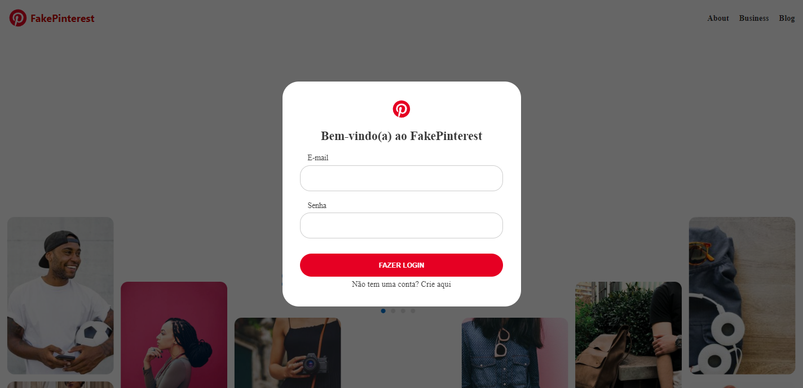
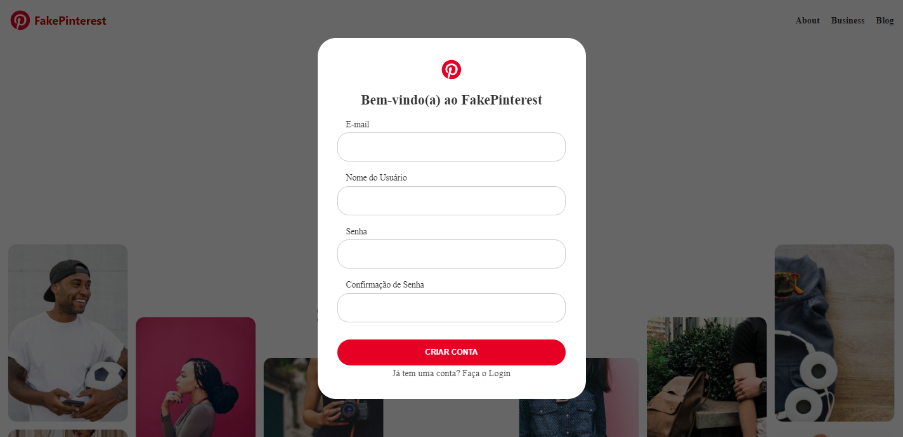
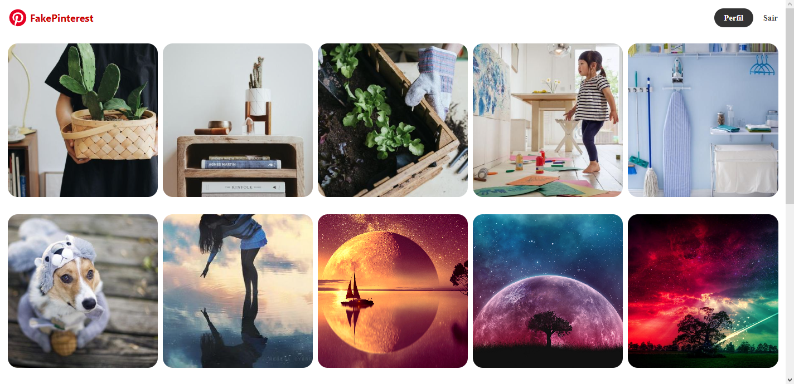
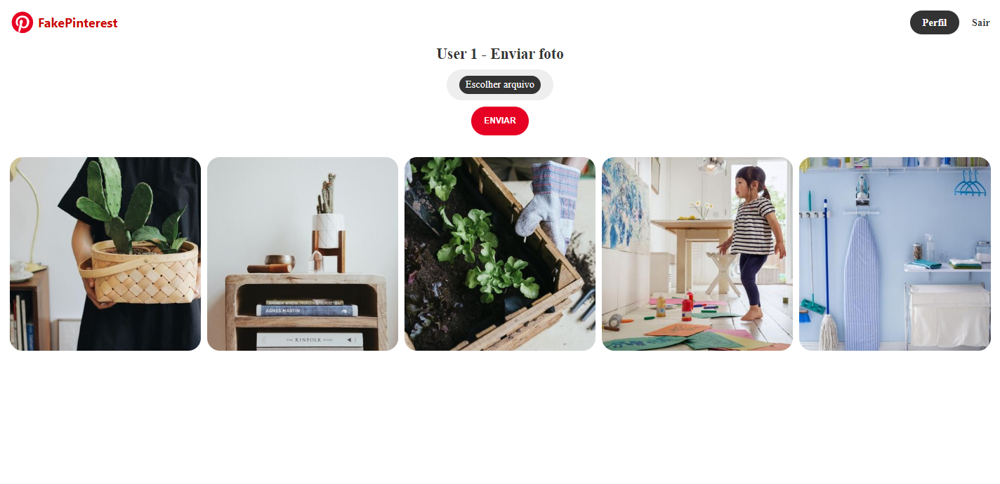

# Aplicação Web  

## **Fake Pinterest**

*Página web que simula a aplicação Pinterest. É necessário realizar o cadastrado na página e realizar o login para ser possível visualizar ou adicionar imagens. Possui a página de feed, na qual, possiu todas as imagens postadas por cada usuário. Também é possível clicar na imagem e visualizar apenas as postadas por cada usuário.*

## Ferramentas

  
  
  
  
  

# Página Principal

# Criar conta

# Feed

# Perfil

 

 
 

# Créditos
<table>
  <tr>
    <td align="center">
      <a href="https://github.com/fabriciovale20">
         
        
          <b>Fabrício Vale</b>
        
      </a>
    </td>
  </tr>
</table>
